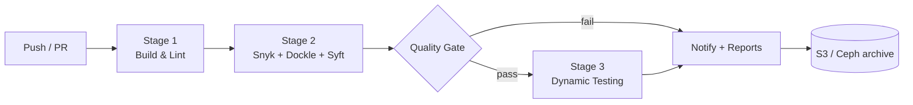

# TESCO — Automated Docker Image Testing & Scanning Pipeline (Prototype Framework)

End-to-end, production-grade **prototype** CI/CD framework for automated building,
security scanning, and dynamic testing of Docker container images, per the HPE
proposal to TESCO. POC target: **Apache Spark + Kyuubi** stack.

> ⚠️ **Status: PROTOTYPE.** Everything marked `TBD-TESTING-TEAM` in
> `config/pipeline-config.yml` and `docs/05_DISCOVERY_CHECKLIST_FOR_TESTING_TEAM.md`
> must be collected from the TESCO testing team, after which the framework is
> tuned accordingly. The pipeline runs end to end today with safe defaults.

---

## What Is in This Repository — Two Framework Variants

This repository contains **two variants of the same image-testing framework**.
They share the same 3-stage pipeline design (Build & Lint → Security Scan +
Quality Gate → Dynamic Testing, then Reports/Notify/Archive) but target
different situations:

| | **Root framework** (this level) | [`TESCO_IMAGE_PIPELINE_FRAMEWORK/`](TESCO_IMAGE_PIPELINE_FRAMEWORK/) |
|---|---|---|
| **Purpose** | Enterprise target-state prototype, per the HPE→TESCO proposal | Self-contained demo/evaluation version — runs out of the box |
| **CVE scanner** | **Snyk** (requires a `SNYK_TOKEN` repo secret) | **Trivy** (open source, no account or token needed) |
| **Other scanners** | Dockle (CIS), Syft (SBOM) | Same: Dockle (CIS), Syft (SBOM) |
| **Test data** | None bundled — real cases come from the TESCO testing team (`docs/05`) | Bundled **sample retail star schema** (`stores`/`products`/`retail_sales` CSVs) + a sample Manual Test Case Document (`tests/testcases/TEST_CASES.md`) |
| **Stage 3 tests** | Smoke + basic Spark SQL via JDBC | Smoke + SQL joins, **data-quality checks and a performance budget** against the sample data |
| **Local execution** | CI-first (GitHub Actions) | One command: `bash scripts/run_local_pipeline.sh` (only Docker required) |
| **Secrets needed for a green run** | `SNYK_TOKEN` (Slack/S3 optional) | **None** — notifications and S3 archival auto-skip when unconfigured |
| **Documentation** | `docs/01`–`05` operational guides | `README.md` + `STEP_BY_STEP_GUIDE.md` walkthrough |

**Which one runs in CI?** Only the **root** framework: GitHub Actions executes
workflows from `.github/workflows/` at the repository root. The copies under
`TESCO_IMAGE_PIPELINE_FRAMEWORK/.github/workflows/` are inert here by design —
to run that variant in CI, push the folder's *contents* as the root of its own
repository (see its `STEP_BY_STEP_GUIDE.md`, Part 2). To try it locally, no
repository is needed at all — just Docker.

**Suggested use:** evaluate and demo with `TESCO_IMAGE_PIPELINE_FRAMEWORK/`
(zero setup), then adopt the root framework for the real rollout once the
Snyk account and the testing team's inputs (`docs/05`) are available.

---

## Repository Layout

```text
TESCO_CICD/
├── README.md                          <- You are here
├── TESCO_IMAGE_PIPELINE_FRAMEWORK/    <- Self-contained variant (Trivy, sample data,
│                                         local runner) — see comparison table above
├── .github/
│   └── workflows/
│       ├── image-pipeline.yml         <- Main pipeline (Stages 1-3 + gate + reports)
│       └── periodic-rescan.yml        <- Scheduled vulnerability re-scan
├── spark-kyuubi-image/                <- POC image: Apache Spark + Kyuubi
│   ├── Dockerfile                     <- Multi-stage, non-root, HEALTHCHECK
│   ├── .dockerignore
│   ├── .hadolint.yaml                 <- Dockerfile lint rules
│   ├── docker-compose.test.yml        <- Stage 3 dynamic test environment
│   ├── conf/
│   │   ├── spark-defaults.conf
│   │   └── kyuubi-defaults.conf
│   └── tests/
│       ├── unit/run_tests.sh          <- Config/script validation (JUnit output)
│       ├── smoke/smoke_test.sh        <- Health, ports, process checks
│       └── integration/integration_test.sh  <- JDBC/Thrift + Spark SQL tests
├── scripts/
│   ├── quality_gate.sh                <- Enforces security thresholds
│   ├── notify.sh                      <- Slack/Teams success & failure alerts
│   └── upload_to_s3.sh                <- Archive reports/SBOM to S3 or Ceph
├── config/
│   ├── pipeline-config.yml            <- Central config + TBD placeholders
│   └── allowlist.yml                  <- Security-approved vulnerability exceptions
└── docs/
    ├── 01_PREREQUISITES_AND_TOOLS_SETUP.md
    ├── 02_CONFIGURATION_GUIDE.md
    ├── 03_PIPELINE_MANAGEMENT_GUIDE.md    <- Step-by-step CI/CD operations guide
    ├── 04_ONBOARDING_NEW_IMAGES.md
    └── 05_DISCOVERY_CHECKLIST_FOR_TESTING_TEAM.md
```

## Pipeline at a Glance



| Stage | Job in workflow | Tools | Blocks pipeline on |
|-------|-----------------|-------|--------------------|
| 1. Build & Lint | `build-and-lint` | Buildx, Hadolint, unit tests | Lint errors, build failure, unit test failure |
| 2. Security Scan | `security-scan` | Snyk, Dockle, Syft | — (reports only; gate decides) |
| Quality Gate | `security-scan` (last step) | `scripts/quality_gate.sh` | Critical CVEs, secrets, fatal CIS violations |
| 3. Dynamic Test | `dynamic-test` | docker compose, beeline, spark-sql | Health/smoke/integration failures |
| Report & Notify | `report-and-notify` | Slack/Teams webhook, S3 sync | Never (runs `always()`) |

## Quick Start

1. Read **`docs/01_PREREQUISITES_AND_TOOLS_SETUP.md`** — install tools, create
   GitHub secrets, connect Snyk / S3 / Slack.
2. Push this folder to a GitHub repository (this directory is the repo root —
   `.github/workflows/` must sit at the root).
3. Open **Actions → Docker Image Testing & Scanning Pipeline → Run workflow**
   to trigger the first run manually, or push any change under
   `spark-kyuubi-image/`.
4. Review artifacts and the Security tab; then follow
   **`docs/03_PIPELINE_MANAGEMENT_GUIDE.md`** for day-to-day operation.

## Design Principles

- **Fail fast, report always** — every stage uploads its reports even on failure;
  the notify job runs unconditionally.
- **Gate is code** — thresholds live in `config/pipeline-config.yml` and
  `scripts/quality_gate.sh`, reviewed like any other change.
- **Exceptions are auditable** — accepted risks go in `config/allowlist.yml`
  with owner + expiry, never as silent flag changes.
- **Everything TBD is explicit** — placeholders reference the discovery
  checklist so nothing from the testing team gets lost.
