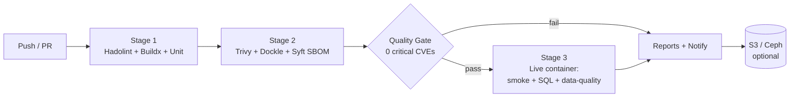

# TESCO Image Pipeline Framework — Self-Contained, Runs Out of the Box

A complete, **enterprise-grade prototype** CI/CD framework for automated Docker
image **building, security scanning, and dynamic testing** — built so it works
**immediately with zero external inputs**:

- ✅ **No testing-team input needed** — realistic enterprise sample data and
  test scenarios are included (retail sales dataset + a full sample test-case
  document, all automated).
- ✅ **No paid accounts / tokens needed** — scanning uses open-source
  **Trivy + Dockle + Syft** (Snyk can be swapped in later; see the guide).
- ✅ **No cloud needed to try it** — `scripts/run_local_pipeline.sh` runs the
  entire pipeline end to end on any machine with Docker.
- ✅ **Everything optional degrades gracefully** — Slack/Teams notifications
  and S3/Ceph archival activate automatically when their secrets exist, and
  skip cleanly when they don't.

POC image: **Apache Spark + Kyuubi** (per the HPE→TESCO proposal).

---

## 📖 Start Here

**`STEP_BY_STEP_GUIDE.md`** — the detailed, from-scratch walkthrough:
run it locally in 10 minutes, then on GitHub Actions, then extend it.

## Folder Layout

```text
TESCO_IMAGE_PIPELINE_FRAMEWORK/
├── README.md                        <- you are here
├── STEP_BY_STEP_GUIDE.md            <- DETAILED step-by-step instructions
├── .github/workflows/
│   ├── image-pipeline.yml           <- main pipeline (3 stages + gate + reports)
│   └── periodic-rescan.yml          <- weekly CVE re-scan of released images
├── spark-kyuubi-image/              <- the image under test
│   ├── Dockerfile                   <- multi-stage, pinned, non-root, HEALTHCHECK
│   ├── .hadolint.yaml / .dockerignore
│   ├── docker-compose.test.yml      <- Stage 3 test environment (mounts sample data)
│   ├── conf/                        <- spark-defaults.conf, kyuubi-defaults.conf
│   ├── sample-data/                 <- ENTERPRISE SAMPLE DATA (retail sales star schema)
│   │   ├── stores.csv  products.csv  retail_sales.csv
│   └── tests/
│       ├── testcases/TEST_CASES.md  <- sample enterprise Manual Test Case Document
│       ├── unit/run_tests.sh        <- TC-U* static validations
│       ├── smoke/smoke_test.sh      <- TC-S* liveness checks
│       └── integration/integration_test.sh  <- TC-I* functional + data-quality + perf
├── scripts/
│   ├── run_local_pipeline.sh        <- FULL PIPELINE LOCALLY, one command
│   ├── quality_gate.sh              <- threshold enforcement (Trivy + Dockle JSON)
│   ├── notify.sh                    <- Slack/Teams (auto-skip if not configured)
│   └── upload_to_s3.sh              <- S3/Ceph archive (auto-skip if not configured)
├── config/
│   ├── pipeline-config.yml          <- all thresholds/settings, fully populated
│   └── allowlist.yml                <- time-boxed vulnerability exceptions (sample incl.)
└── samples/                         <- example outputs so you know what "good" looks like
    ├── sample-run-summary.md
    ├── sample-notification-success.json
    └── sample-notification-failure.json
```

## The Pipeline



| Stage | Tools | Fails the pipeline on |
|---|---|---|
| 1 — Build & Lint | Hadolint, Docker Buildx, unit tests | lint error, build error, unit failure |
| 2 — Security Scan | Trivy (CVEs+secrets, SARIF), Dockle (CIS), Syft (SBOM) | nothing directly — the gate decides |
| Quality Gate | `scripts/quality_gate.sh` | critical CVEs > 0, high CVEs > 10, secrets, Dockle FATAL |
| 3 — Dynamic Testing | docker compose, beeline/Spark SQL over **sample retail data** | health/smoke/functional/data-quality/perf failure |
| Report & Notify | GitHub artifacts, step summary, Slack/Teams, S3 | never (always runs) |

## 60-Second Quick Start (local, Docker only)

```bash
cd TESCO_IMAGE_PIPELINE_FRAMEWORK
bash scripts/run_local_pipeline.sh          # Linux / macOS / WSL / Git Bash
# reports land in ./reports/, exit code 0 = full pipeline green
```

Quick start on GitHub: push this folder as a repo root → Actions →
**Docker Image Testing & Scanning Pipeline** → *Run workflow*. No secrets
required for a green run. Full instructions: `STEP_BY_STEP_GUIDE.md`.

## Enterprise Sample Scenario Included

A miniature TESCO-style retail star schema (`sample-data/`): **stores**
(5 UK stores, 3 regions) × **products** (8 grocery SKUs, 4 categories) ×
**retail_sales** (20 transactions). Stage 3 loads it through Kyuubi into
Spark SQL and validates:

- ingestion (CSV → tables, row counts),
- analytics (revenue-per-region 3-way join, top-category aggregation),
- **data quality** (no null keys, no negative quantities, referential integrity),
- **performance budget** (join completes within 60 s),
- security posture at runtime (container runs as non-root).

Each check maps 1:1 to a test case ID in `tests/testcases/TEST_CASES.md` —
when the real testing team's checklist arrives, replace/extend those cases the
same way.
